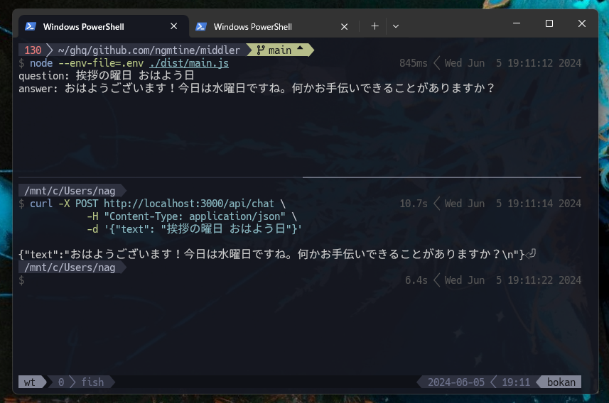

# middler: chatgpt api

By setting up a local server with Hono.js and automating Chrome via Puppeteer, we'll deliver a ChatGPT API.



## 前提

windows(chrome), wsl(puppeteer)

## 準備

ホスト側のアドレスを確認する  
https://qiita.com/lx-sasabo/items/9817adf4fa731b985b00  
`ip route | grep 'default via' | grep -Eo '[0-9]{1,3}\.[0-9]{1,3}\.[0-9]{1,3}\.[0-9]{1,3}'`

ポートフォワーディングしておく  
`netsh interface portproxy add v4tov4 listenaddress=[さっきのアドレス] listenport=9222 connectaddress=127.0.0.1 connectport=9222`

ファイアウォール許可  
`New-NetFirewallRule -DisplayName 'chromedebug' -Direction Inbound -LocalPort 9222 -Protocol TCP -Action Allow`  
`New-NetFirewallRule -DisplayName 'chromedebug' -Direction Outbound -RemotePort 9222 -Protocol TCP -Action Allow`

`.env`を用意する  
`.env.example`をリネームするだけでいいはず

## 使い方

win 側の chrome を--remote-debugging-port を指定して起動  
https://stackoverflow.com/questions/67703601/running-puppeteer-on-wsl2-controlling-the-chrome-on-windows  
`Start-Process -FilePath "C:\Program Files\Google\Chrome\Application\chrome.exe" -ArgumentList "--remote-debugging-port=9222"`

wsl 側でサーバープロセス起動  
`node --env-file=.env ./dist/main.js`

## 疎通確認

```sh
curl -X POST http://localhost:3000/api/chat \
      -H "Content-Type: application/json" \
      -d '{"text": "バナナのナス バナナス"}'
```

## todo

エラーで死んだときに自動復帰する機能

## FAQ

・wsl 以外の環境で動かしたい  
=> コントリビュートしてね
